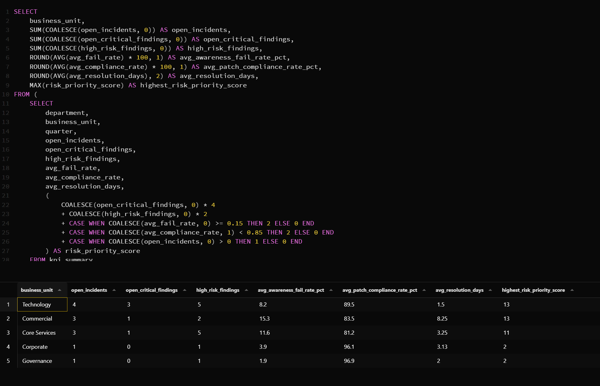
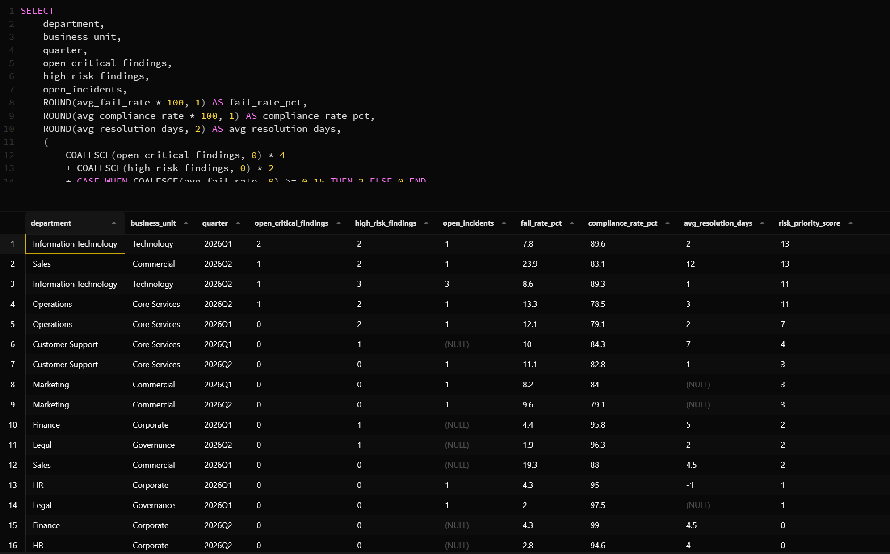

# python-security-operations-data-pipeline
Eigenprojekt zur Bereinigung, Validierung und Analyse von Security- und Operations-Daten mit Python, pandas, SQLite und SQL.

## Ziel

Ziel des Projekts war es, mehrere unbereinigte Datenquellen aus dem Security- und Operations-Umfeld automatisiert aufzubereiten und in belastbare KPI- und Reporting-Outputs zu überführen.

Im Mittelpunkt stand nicht die Erstellung eines weiteren Dashboards, sondern der vorgelagerte Datenprozess: Rohdaten einlesen, Datenqualität prüfen, Daten bereinigen, fachlich validieren, konsolidieren und für Management-Reporting nutzbar machen.

Die zentrale Fragestellung lautete:

> Wie lassen sich Security- und Operations-Rohdaten automatisiert bereinigen, konsolidieren und in belastbare KPIs für Reporting und Priorisierung überführen?

## Verwendete Tools

- Python
- pandas
- pathlib
- sqlite3 / SQLite
- SQL
- CSV- und Markdown-Reporting

## Datengrundlage

Die verwendeten Daten sind synthetisch erstellt und dienen ausschließlich Demonstrationszwecken.

Verarbeitet wurden mehrere Datenquellen zu:

- Incidents
- Security Findings
- Awareness- und Phishing-Kampagnen
- Trainingsquoten
- Patch Compliance
- Departments, Business Units und Regionen

Die Rohdaten befinden sich im Ordner [data/raw](data/raw). Die bereinigten und aufbereiteten Ergebnisdateien befinden sich unter [data/processed](data/processed).

## Datenqualität und Bereinigung

Die Rohdaten enthalten bewusst typische Datenqualitätsprobleme, die auch in realen Unternehmensdaten auftreten können. Dazu gehören unter anderem:

- Uneinheitliche Department-Bezeichnungen
- Unterschiedliche Datumsformate
- Zahlenwerte als Text
- Fehlende Werte
- Doppelte Datensätze bzw. IDs
- Uneinheitliche Statuswerte
- Unplausible Werte bei Zeiträumen, Compliance oder Phishing-Kennzahlen

Die Pipeline standardisiert Spaltennamen und Textwerte, korrigiert Datentypen, prüft Dubletten und behandelt fehlende Werte anhand fachlicher Regeln.

## Fachliche Validierung

Neben der technischen Bereinigung werden Business Rules geprüft. Beispiele:

- Ein Lösungsdatum darf nicht vor dem Erstellungsdatum liegen.
- Ein Schließdatum darf nicht vor dem Eröffnungsdatum liegen.
- Patch Compliance muss zwischen 0 und 100 Prozent liegen.
- Konforme Assets dürfen nicht größer sein als die Gesamtzahl der Assets.
- Failures und Klicks dürfen nicht größer sein als die Anzahl versendeter Phishing-E-Mails.
- Negative Zeiten oder Anzahlen werden als Datenqualitätsproblem erkannt.

Auffällige Werte werden nicht unbemerkt weiterverarbeitet, sondern im Data-Quality-Reporting sichtbar gemacht.

## Vorgehen

1. Einlesen mehrerer CSV-Rohdatenquellen mit Python und pandas
2. Profiling der Datenbasis: Datentypen, fehlende Werte, Dubletten und auffällige Kategorien
3. Standardisierung von Spaltennamen, Department-Bezeichnungen und Statuswerten
4. Korrektur von Datums- und Zahlenformaten
5. Anwendung fachlicher Validierungsregeln
6. Ableitung zusätzlicher Felder, zum Beispiel Quarter, Resolution Days und Risikokennzeichen
7. Konsolidierung der Daten über eine Department-Dimension
8. Speicherung der bereinigten Tabellen in einer SQLite-Datenbank
9. SQL-basierte KPI-Analysen und Risikoauswertungen
10. Erstellung von Data-Quality- und Management-Reporting-Outputs

## Analysierte Kennzahlen

- Offene Incidents
- Offene kritische Findings
- Durchschnittliche Lösungsdauer
- Incident-Volumen nach Quarter
- Phishing Fail Rate nach Department
- Trainingsquote nach Department
- Patch Compliance nach Department bzw. Business Unit
- Kombinierte Risiko-Priorisierung
- Datenqualitätskennzahlen, zum Beispiel Dubletten, fehlende Werte und Validierungsverletzungen

## Ergebnisse

Die Pipeline erzeugt eine bereinigte und konsolidierte Datenbasis für weitere SQL-, Reporting- oder BI-Auswertungen.

Zusätzlich werden folgende Ergebnisse erzeugt:

- Bereinigte CSV-Dateien für die einzelnen Datendomänen
- Konsolidierter KPI-Datensatz
- SQLite-Datenbank mit bereinigten Tabellen
- SQL-Abfragen für Risiko- und KPI-Analysen
- Data-Quality-Report
- Data-Quality- und KPI-Reporting-Outputs als CSV-Dateien

## Risikopriorisierung

Die Managementauswertung verbindet mehrere Risikodimensionen:

- offene kritische Findings
- Incident-Belastung
- Lösungsdauer
- Awareness-Risiko
- Trainingsquote
- Patch Compliance

Dadurch lassen sich Departments oder Business Units erkennen, bei denen mehrere Risikofaktoren gleichzeitig auftreten und die deshalb priorisiert betrachtet werden sollten.

## Screenshots

### Business Unit Management Summary



### Combined Risk Prioritisation



## Projektdateien

- [data/raw](data/raw) – synthetische Rohdaten als CSV-Dateien
- [data/processed](data/processed) – bereinigte und konsolidierte Ergebnisdaten
- [database](database) – SQLite-Datenbank mit bereinigten Tabellen
- [reports](reports) – Data-Quality-Report und Management-Reporting
- [screenshots](screenshots) – Screenshots der SQL-basierten Managementauswertungen
- [sql](sql) – SQL-Abfragen für KPI- und Risikoanalysen
- [src](src) – Python-Code für Datenprofiling, Bereinigung, Validierung, Transformation und Reporting

## Projektstruktur

```text
python-security-operations-data-pipeline/
├── data/
│   ├── raw/          # synthetische Rohdaten
│   └── processed/    # bereinigte und konsolidierte Daten
├── database/         # SQLite-Datenbank
├── reports/          # Data-Quality- und Management-Outputs
├── screenshots/      # Screenshots der Analysen
├── sql/              # SQL-Abfragen
└── src/              # Python-Pipeline
```

## Hinweis

Dieses Projekt wurde als Eigenprojekt erstellt, um praktische Kenntnisse in Python, pandas, Datenbereinigung, Datenvalidierung, SQLite, SQL, ETL-nahem Arbeiten und KPI-Reporting anzuwenden.

Es knüpft an das Projekt `security-operations-kpi-dashboard` an: Während das erste Projekt Security- und Operations-KPIs mit SQL und Power BI visualisiert, konzentriert sich dieses Projekt auf die vorgelagerte Aufbereitung, Qualitätssicherung und Konsolidierung der Daten.
